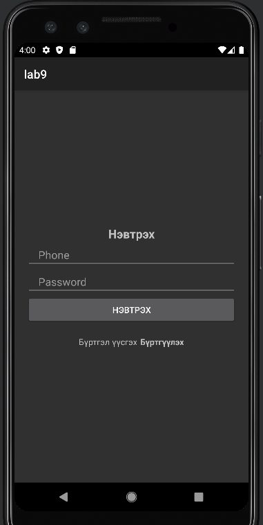
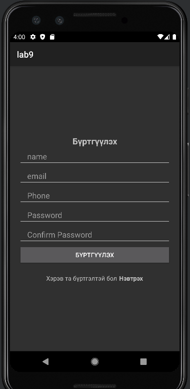
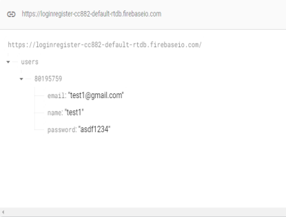

loginReg-in-android - Login and Register App
Overview
This project, named loginReg-in-android, is an Android app that implements a simple Login and Register system using Firebase Realtime Database. Users can register with their name, email, phone number, and password, and log in using their phone number and password.

Project Name: loginReg-in-android
Application Name: loginReg-in-android
Build Target: Android 4.0.3 (API 15)
Features: User registration, login functionality, navigation between activities

Prerequisites

Android Studio: Installed on your development machine
Firebase Account: A project with Realtime Database enabled
Android SDK: API 15 (Ice Cream Sandwich) or higher
Git: Optional, for version control and repository management

Setup Instructions
Clone or Open the Project

If using Git, clone the repository:git clone <repository-url>

Open in Android Studio: File > Open > Select the loginReg-in-android directory

Configure Firebase

Create a Firebase project at console.firebase.google.com
Enable Realtime Database and set rules (for testing):{
  "rules": {
    ".read": "true",
    ".write": "true"
  }
}

Download google-services.json and place it in the app/ directory
Update DatabaseReference URL in Register.java and Login.java (e.g., https://your-project-id-default-rtdb.firebaseio.com/)

Build the Project

Sync Gradle: File > Sync Project with Gradle Files
Build the app: Build > Rebuild Project

Run the App

Connect an Android device or use an emulator (API 15+)
Click Run in Android Studio

Project Structure
Java Files

Login.java: Handles user login functionality
Register.java: Manages user registration and Firebase data storage
MainActivity.java: Main activity after successful login/register
Other files (e.g., Brick.java, GameView.java): Likely for a Brick Breaker game feature

Layout Files (app/src/main/res/layout/)

activity_login.xml: Login screen UI
activity_register.xml: Register screen UI
activity_main.xml: Main activity layout
game_over.xml: Game over screen layout (if part of the game)

Build File

app/build.gradle.kts: Contains Firebase dependencies

Usage
Registration

Tap "Бүртгүүлэх" to access the register screen
Enter name, email, phone number, password, and confirm password
Click "Бүртгүүлэх" to register (checks for empty fields and password match)
On success, redirect to MainActivity

Login

Return to login via "Нэвтрэх" or start the app
Enter phone number and password
Click "Нэвтрэх" to log in (verifies against Firebase)
On success, redirect to MainActivity

Navigation

From login, tap "Бүртгүүлэх" to switch to register
From register, tap "Нэвтрэх" to return to login

Dependencies

Firebase Realtime Database: For user data storage
AndroidX: For UI components (e.g., AppCompatButton)

Notes

Target API: Uses Android 4.0.3 (API 15), consider updating to API 33 for better compatibility
Sensitive Data: google-services.json contains sensitive info; add to .gitignore to avoid public commit
Game Feature: Files like Brick.java suggest a game component; ensure it’s fully implemented

Contributing

Fork the repository
Create a new branch for changes
Submit a pull request with improvements

License
For educational purposes only. No specific license unless specified by your instructor.
